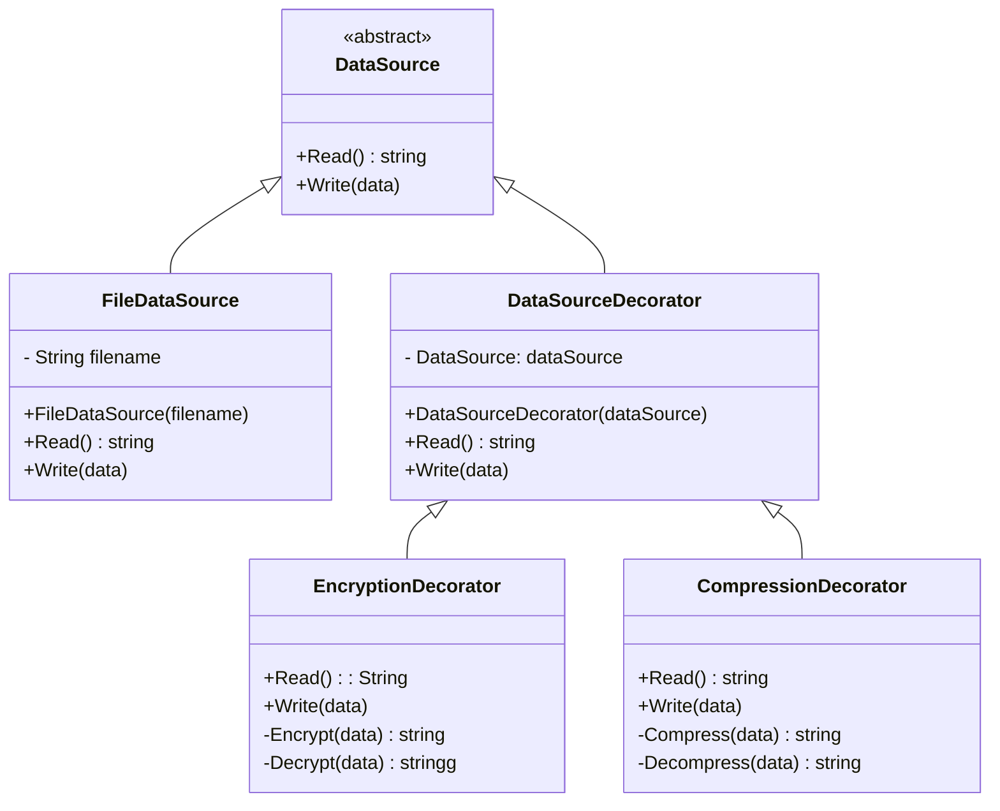

## Decorator

### Real-world sample code

In this example, the Decorator pattern lets you compress and
encrypt sensitive data independently from the code that actually uses this data.

The application wraps the data source object with a pair of
decorators. Both wrappers change the way the data is written
to and read from the disk:

- Just before the data is written to disk, the decorators encrypt
  and compress it. The original class writes the encrypted and
  protected data to the file without knowing about the change.

- Right after the data is read from disk, it goes through the same
  decorators, which decompress and decode it.

- The decorators and the data source class implement the same
  interface, which makes them all interchangeable in the
  client code.
