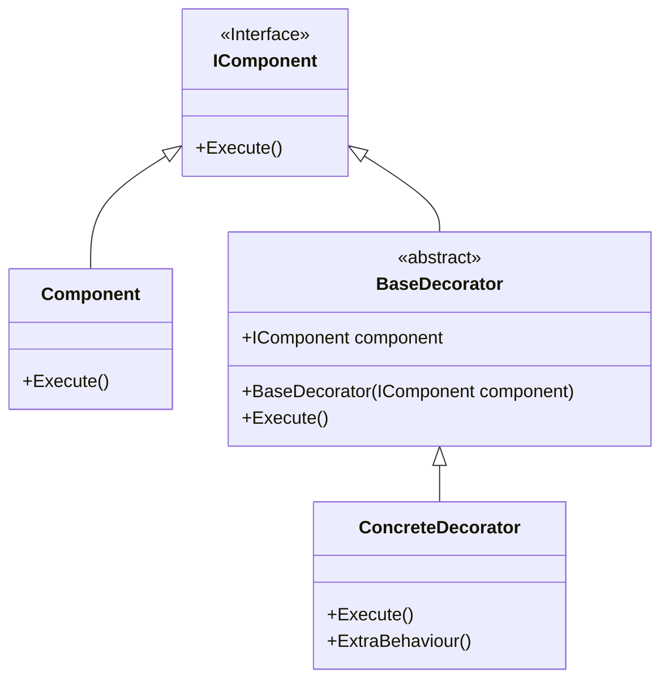
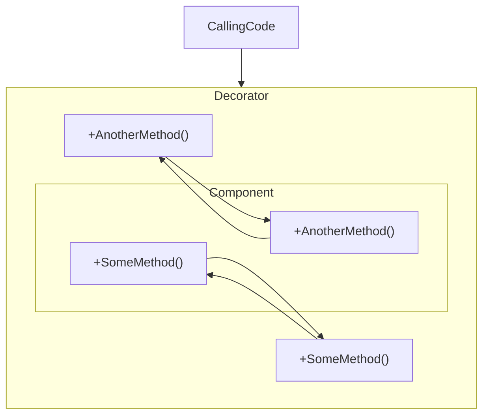
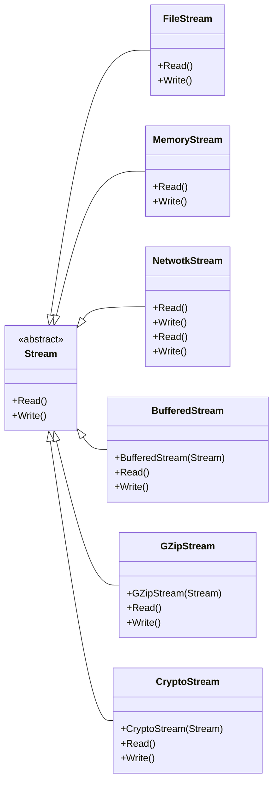

### Decorator

#### Definition

The decorator pattern adds the ability to dynamically add behavior, this is accomplished by wrapping aroung the original
object and intercepting methods.

### Structure



#### Onion Structure of the Decorator Pattern

When you hear the word decorator, it is useful to think about a diagram like this and understand that what you're really
doing is **designing a series of objects that can wrap around each other and inject behavior as needed**. I say a series
of decorator objects because you're not limited to just one decorator object at a time. You can, in fact, define and use
multiple decorator objects together so you can have a layered structure around your original object, much like an onion:



### Participants

- **IComponent**: declares the common interface for both wrappers and wrapped objects;
- **Component**: is a class of objects being wrapped. It defines the basic behavior, which can be altered by decorators;
- **BaseDecorator**: maintains a reference to a Component object and defines an interface that conforms to Component's
  interface The base decorator delegates all operations to the wrapped object.
- **ConcreteDecorator**: define extra behaviors that can be added to components dynamically. Concrete decorators
  override methods of the base decorator and execute their behavior either before or after calling the parent method.
- **Client:** The Client can wrap components in multiple layers of decorators, as long as it works with all objects via
  the component interface.

### Sample Code

The structural code demonstrates the Decorator pattern which dynamically adds extra
functionality to an existing object.

### When and where you would use it

- When you need to apply **cross cutting concerns** like logging, performance trackling, caching and authorization.
- Manipulate data going to/from component.
- The Decorator lets you structure your business logic into layers, create a decorator for each layer and compose
  objects with various combinations of this logic at runtime. The client code can treat all these objects in the same
  way, since they all follow a common interface.
- Use the pattern when it’s awkward or not possible to extend an object’s behavior using inheritance.
- Many programming languages have the `final`  keyword that can be used to prevent further extension of a class. For a
  final class, the only way to reuse the existing behavior would be to wrap the class with your own wrapper, using the
  Decorator pattern.

### Tips

- Make sure your business domain can be represented as a primary component with multiple optional layers over it.
- Figure out what methods are common to both the primary component and the optional layers. Create a component interface
  and declare those methods there.
- Create a concrete component class and define the base behavior in it.
- Create a base decorator class. It should have a field for storing a reference to a wrapped object. The field should be
  declared with the component interface type to allow linking to concrete components as well as decorators. The base
  decorator must delegate all work to the wrapped object.
- Make sure all classes implement the component interface.
- Create concrete decorators by extending them from the base decorator. A concrete decorator must execute its behavior
  before or after the call to the parent method (which always delegates to the wrapped object).
- The client code must be responsible for creating decorators and composing them in the way the client needs.

### .NET Framework Example

An excellent example of this in the .NET framework is the Stream class and its derivatives. All streams in .NET provide
the same basic functionality, however each stream functions differently:

```cs
/* This program takes a string and writes it to a file.
In doing so it is using the CryptoStream class to encrypt the data of the file
and BufferedStream to improve performance by buffering the data before it's written */
using var fileStream = new FileStream(filename, FileMode.Append, FileAccess.Write);
using var stream = new CryptoStream(new BufferedStream(fileStream), encryptor, CryptoStreamMode.Write);
using var writer = new StreamWriter(stream);
writer.Write(text);
```

You can see thw wrapping behaviour where CryptoStream and BufferedStream are
wrapping around a FileStream object.

- **Component**:
    - Stream;
- **Concrete Components:
    - FileStream;
    - MemoryStream;
    - NetworkStream;
- **Decoratos**:
    - BufferedStream;
    - GZipStream;
    - CryptoStream;



---

### Resources

[Refactoring Catalog](https://refactoring.guru/design-patterns/decorator)

[Decorator Design Pattern in C#](https://dotnettutorials.net/lesson/decorator-design-pattern/)

[Source Code](https://github.com/edward-teixeira/design-patterns)
