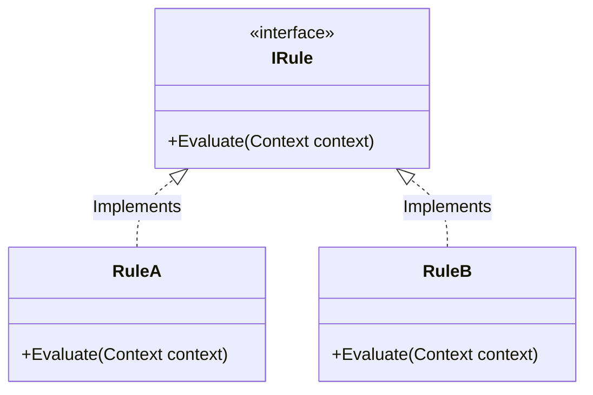
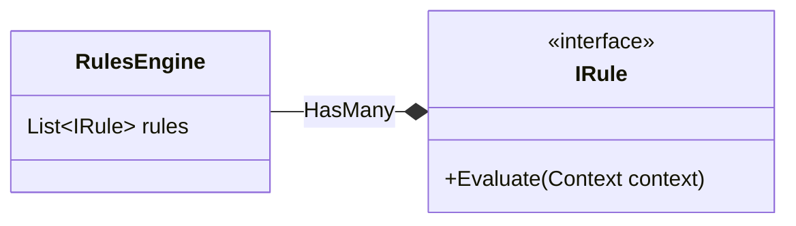

# **Rules Engine Pattern**

*Allows you to organize logic through a set of production rules, each having a condition and an action.*

The Rules Engine implements the notion of a set of rules, where each rule has a condition and a consequential action. The system runs the rules on the data it has through a series of cycles, each cycle identifying the rules whose conditions match, then executes the rules' actions. The Rules Engine is based on the [Production Rule System](https://en.wikipedia.org/wiki/Production_system_(computer_science)).

## Problem

Consider the first stage of an application for joining some imaginary Victorian English club where we need to validate basic application data, just to make sure the form is filled out properly.

For example, here are a few of the validation rules:

- Nationality must not be null.
- University must not be null.
- Annual income must be positive.

## Solution

Let's define the data about the person that the rules will work on. This is a simple data class with properties for the various things we're interested in.

```csharp
class Person {
    public string Name { get; set; }
    public University? University { get; set; }
    public int? AnnualIncome { get; set; }
    public Country? Nationality { get; set; }
}
```

Now move on to the rule processing part. The basic structure of the validation engine is a list of validation rules.

```csharp
class ValidationEngine {
    ...
    List <ValidationRule> rules = new List<ValidationRule>();
}

interface IValidationRule {
    ...
    void Check(Notification note, Person p);
}
```

To run the engine, all I do is run each of the rules, collecting the result.

```csharp
class ValidationEngine {
    // We are collecting the result using the Notification Pattern
    public Notification Run(Person p) {
        var result = new Notification();
        foreach (var r in rules)
        {
            r.Check(result, p);
        };
        return result;
    }
}
```

The most basic validation rule takes a predicate and a message to record if it fails.

```csharp
class ExpressionValidationRule : ValidationRule {
    readonly Predicate<Person> condition;
    readonly string description;

    public ExpressionValidationRule(Predicate<Person> condition, string description) {
        this.condition = condition;
        this.description = description;
    }

    public void Check(Notification note, Person p) {
        if (!condition(p))
        {
            note.AddError(String.Format("Validation '{0}' failed.", description));
        }
    }
}
```

We can then set up and run rules using the command-query interface with code like this:

```csharp
engine = new ValidationEngine();
engine.AddRule(p => p.Nationality != null, "Missing Nationality");
var tim = new Person("Tim");
var note = engine.Run(john);
```

### Related Patterns

[Builder](https://en.wikipedia.org/wiki/Builder_pattern),
[Function Sequence](https://martinfowler.com/dslCatalog/functionSequence.html),
[Method Chaining](https://en.wikipedia.org/wiki/Method_chaining),
[Nested Closure](https://martinfowler.com/dslCatalog/nestedClosure.html).

## Structure





## When to use this pattern

- When you have behavior that **feels like it is best expressed as a set of if-then statements**.
- Validations are a good simple example of a Rules Engine, as they are common and usually don't involve any chaining.

## Issues and considerations

- It's simplest if you keep your rules read‑only so they don't have any side effects on the system they're evaluating;
- If you do choose to create rules that change the system that your rules are evaluating, you may need to consider dependencies between your rules;
- You may find that your rules change frequently enough that you want to allow end users to edit them, in which case you need to consider how you will persist the rules and how you will create a user interface that allows them to be edited;
- The big danger with Rules Engine is that they are so seductive - it's very easy to stretch a tool—to use it in lots of places without realizing how difficult it is to modify until you've already built something too large;
- It may become very hard to reason about what a Rules Engine is doing as it gets bigger, particularly if you are using chaining. This can make debugging very difficult.

## Real World Example

*[FluentValidation](https://github.com/FluentValidation/FluentValidation) is a .Net library that uses the Rules Engine Pattern to provide validations on it's API*

[Microsoft Rules Engine](https://github.com/microsoft/RulesEngine)

## Code Sample

*Provide a link to a implementation repository.*

## Reference

- [RulesEngine](https://martinfowler.com/bliki/RulesEngine.html)

- [Domain Specific Languages - Chapter 50](https://martinfowler.com/books/dsl.html)

- [Notification Pattern](https://martinfowler.com/eaaDev/Notification.html)
