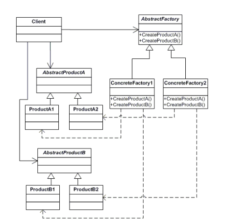

## Abstract Factory

### Definition

Provide an interface for creating families of related or dependent objects without specifying their concrete classes.

### UML Class Diagram



### Participants

The classes and/or objects participating in this pattern are:

- **AbstractFactory (ContinentFactory)**: declares an interface for operations that create abstract products;
- **ConcreteFactory (AfricaFactory, AmericaFactory)**: implements the operations to create concrete product objects;
- **AbstractProduct (Herbivore, Carnivore)**: declares an interface for a type of product object;
- **Product (Wildebeest, Lion, Bison, Wolf)**: defines a product object to be created by the corresponding concrete
  factory implements the AbstractProduct interface;
- **Client (AnimalWorld)**: uses interfaces declared by AbstractFactory and AbstractProduct classes;

### Sample Code

The structural code demonstrates the Abstract Factory pattern creating parallel hierarchies of objects. Object creation
has been abstracted and there is no need for hard-coded class names in the client code.

### Abstract Factory: when and where you would use it

The Abstract Factory pattern provides a class that creates objects that are related by a common theme. The classic
example is that of a GUI component factory which creates UI controls for different windowing systems, such as, Windows,
Motif, or MacOS. In case you’re familiar with Java Swing, it represents a great example of the use of the Abstract
Factory pattern to build UI interfaces that are independent of their hosting platform. From a design pattern
perspective, Java Swing succeeded, but applications built on this platform are limited in their interactivity and
responsiveness compared to native Windows or native Motif applications.

Over time the meaning of the Abstract Factory pattern has evolved relative to the original GoF definition. Today, when
developers talk about the Abstract Factory pattern they not only mean the creation of a ‘family of related or dependent
objects' but also a simpler notion which is the creation of individual object instances. Perhaps you are wondering why
you would want to create objects using another class
(called Abstract Factory) rather than calling constructors directly. Here are some reasons:

Constructors are limited in their control over the overall creation process. If your application needs more control then
use a Factory instead. Possible scenarios where this may be the case is when the creation of objects involves object
caching, sharing or re-using of objects, and applications that need to maintain object and type counts.

Additionally, there are times when the client does not know exactly what type to construct. It is easier to code against
a base type or an interface and then let a factory make this decision for the client (based on parameters or other
context-based information). The provider-specific ADO.NET objects (i.e. DbConnection, DbCommand, DbDataAdapter, etc.)
are a good example of this.

Constructors don’t communicate their intention very well because they must be named after their class (or Sub New in VB)
. Having numerous overloaded constructors may make it hard for the client developer to decide which constructor to use.
Replacing constructors with a Factory that has intention-revealing creation methods may be preferred. Here is an example
of 4 overloaded constructors. These first examples show that it is not always clear which one to use.

````c#
public Vehicle (int passengers)
public Vehicle (int passengers, int horsePower)
public Vehicle (int wheels, bool trailer)
public Vehicle (string type)
````

The Factory pattern makes the code far more expressive.

````c#
public Vehicle CreateCar (int passengers)
public Vehicle CreateSuv (int passengers, int horsePower)
public Vehicle CreateTruck (int wheels, bool trailer)
public Vehicle CreateBoat ()
public Vehicle CreateBike ()
````

### Abstract Factory in the .NET Framework

A search through the .NET Framework libraries for the word ‘Factory’ reveals many classes that are implementations of
the Factory design pattern. ADO.NET, for example, includes two Abstract Factory classes that offer provider independent
data access. They are: DbProviderFactory and DbProviderFactories. The DbProviderFactory creates the ‘true’ (i.e.
database specific) classes you need; in the case of SQL Server they are SqlClientConnection, SqlClientCommand, and
SqlClientDataAdapter. Each managed provider (such as, SqlClient, OleDb, ODBC, or Oracle) has its own DbProviderFactory
class. DbProviderFactory objects, in turn, are created by the DbProviderFactories class
(note: the name is plural), which itself is a factory. In fact, it is a factory of factories -- it manufactures
different factories, one for each provider.

When Microsoft talks about Abstract Factories they mean types that expose factory methods as virtual or abstract
instance functions and that return an abstract class or interface. Below is an example from .NET:

````c#
public abstract class StreamFactory
{
public abstract Stream CreateStream();
}
````

In this scenario your factory inherits from StreamFactory and is used to dynamically select the actual Stream type being
created:

````c#
public class MemoryStreamFactory : StreamFactory
{
...
}
````

The naming convention in .NET for the Factory pattern is to append the word ‘Factory’ to the name of the type that is
being created. For example, a class that manufactures Widget objects would be named WidgetFactory.
