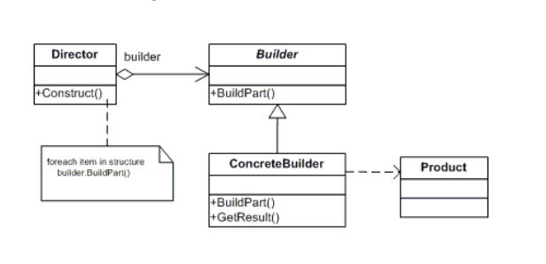

## Builder

### Definition

Separate the construction of a complex object from its representation so
that the same construction process can create different representations.

### Uml Diagram

### Participants

The classes and/or objects participating in this pattern are:

- **Builder**: specifies an abstract interface for creating parts of a Product object;
- **ConcreteBuilder**:
    - constructs and assembles parts of the product by implementing the
      Builder interface;
    - defines and keeps track of the representation it creates;
    - provides an interface for retrieving the product;
- **Director**: defines the order in which to call construction steps;
- **Product**:
    - represents the complex object under construction. ConcreteBuilder builds
      the product's internal representation and defines the process by which it's
      assembled;
    - includes classes that define the constituent parts, including interfaces for
      assembling the parts into the final result;

### Structural sample code

The structural code demonstrates the Builder pattern in which complex objects are
created in a step-by-step fashion. The construction process can create different object
representations and provides a high level of control over the assembly of the objects.

### When and where you would use it

The Builder design pattern is a creational pattern that allows the client to construct a
complex object by specifying the type and content only. Construction details are hidden
from the client entirely. The most common motivation for using Builder is to simplify
client code that creates complex objects. The client can still direct the steps taken by
the Builder, without knowing how the actual work is accomplished. Builders frequently
encapsulate construction of Composite objects (another design pattern) because the
procedures involved are often repetitive and complex.

A scenario where the Builder can be helpful is when building a code generator.
Suppose you’re writing an application that writes stored procedures for different
database vendors (SQL Server, Oracle, or Db2). The actual output is quite different but
the different steps of creating the separate procedures that implement the CRUD
statements (Create, Read, Update, and Delete) are similar.
Builder is a creational pattern just like the Factory patterns. However, Builder gives you
more control in that each step in the construction process can be customized; Factory
patterns create objects in a single step.

### .NET Framework Example

The Builder design pattern is used infrequently, but you do find it in the .NET libraries.
Two classes, VBCodeProvider and CSharpCodeProvider, create Builder classes through
their CreateGenerator methods (as an aside, both CodeProvider classes are factory
classes). The CreateGenerator methods return an ICodeGenerator interface through
which the generation of source code can be controlled. Visual Studio .NET uses these
code generating Builder classes internally.
